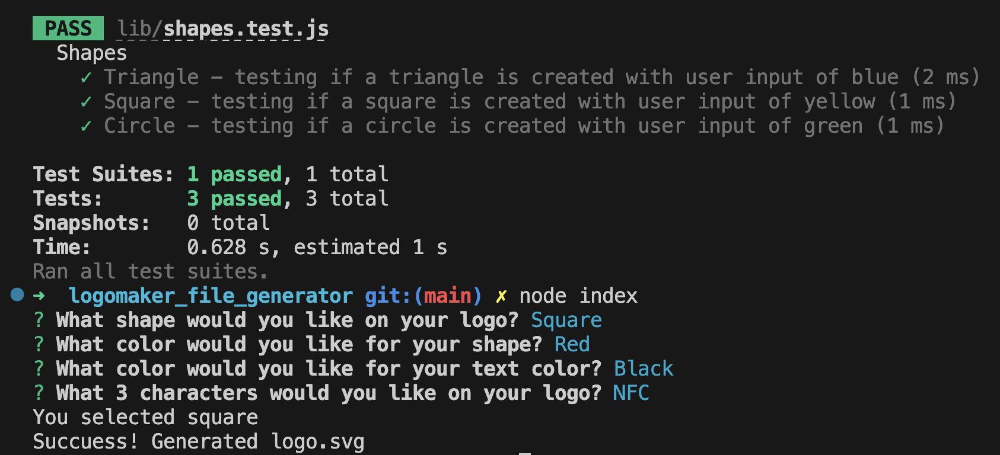

# logomaker_file_generator

## Description

A program to generate a logo taking in user input and creating an SVG file. The motivation for this project was to create a program that will generate an SVG file with a logo. 

User Story
AS a freelance web developer
I WANT to generate a simple logo for my projects
SO THAT I don't have to pay a graphic designer

Acceptance Criteria
GIVEN a command-line application that accepts user input
WHEN I am prompted for text
THEN I can enter up to three characters
WHEN I am prompted for the text color
THEN I can enter a color keyword (OR a hexadecimal number)
WHEN I am prompted for a shape
THEN I am presented with a list of shapes to choose from: circle, triangle, and square
WHEN I am prompted for the shape's color
THEN I can enter a color keyword (OR a hexadecimal number)
WHEN I have entered input for all the prompts
THEN an SVG file is created named `logo.svg`
AND the output text "Generated logo.svg" is printed in the command line
WHEN I open the `logo.svg` file in a browser
THEN I am shown a 300x200 pixel image that matches the criteria I entered

Through this project I learned how to create SVG files using HTML and XML. I also learned how to use inquirer to gather user input that will be used within the code to generate the HTML/XML code. I learned how to use Jest to test my user input to ensure the program was running as expected.

## Table of Contents

- [Installation](#installation)
- [Usage](#usage)
- [Credits](#credits)
- [License](#license)
- [Tests](#tests)

## Installation

TO install this program you will need to download the project files to your computer and open the integrated terminal. You will then run the command "node index.js" within the terminal. The program will present you with prompts and you will need to answer these questions.

## Usage

Once you have downloaded the program files you will run the command "node index.js" within the terminal. The program will present you with questions about what shape, shape color, text color and text. Taking these inputs the program will generate an SVG file with specifications for your logo. The logo will be created in a file named "logo.svg"

Video to demonstrate program functionality: https://drive.google.com/file/d/1dJwkUpCJ-VjIKNaXAl5DTAW37o6H1HaZ/view 

## Credits

I used documentation from the mdn website at: https://developer.mozilla.org/en-US/

I read forums on StackOverFlow at: https://stackoverflow.com/

## License

This project uses an MIT license.

## Tests

This program uses Jest to run tests on the user input for shape and color. To run the tests, open the integrated terminal and run the command "npm test"